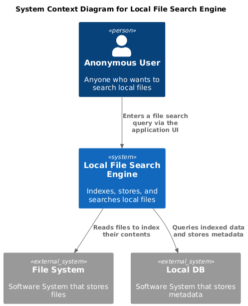
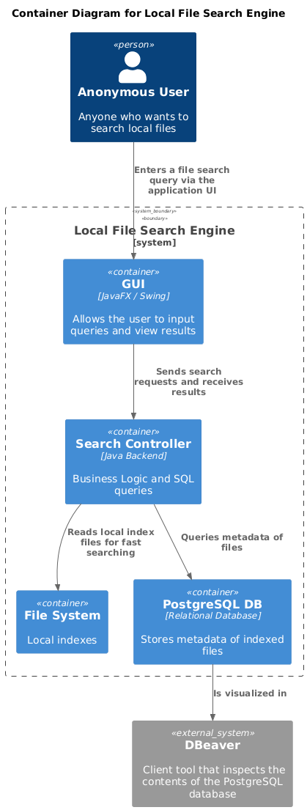
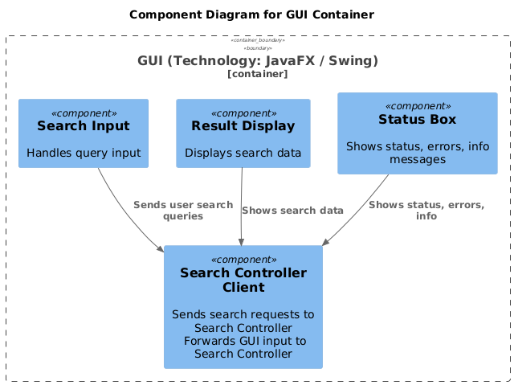
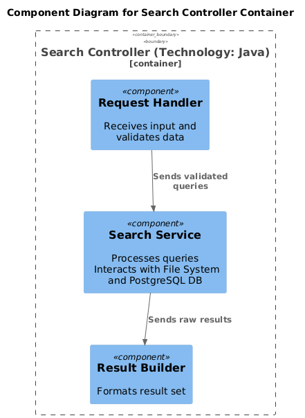
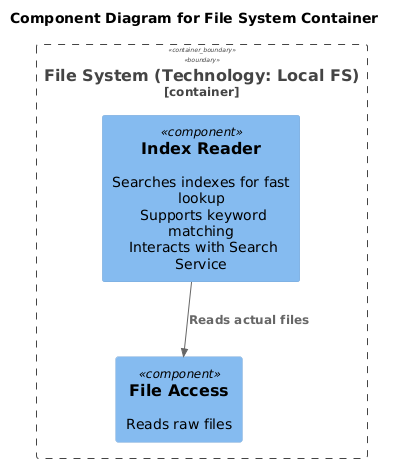
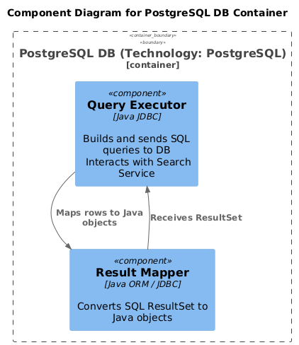

# Local File Search Engine

Software Design Project\
Technical University of Cluj-Napoca, Romania

Student: Mara Mureșan - 3rd year student, Computer Science\
Teaching assistant: Daniel Ciugurean

## Overview

This document uses the C4 Model proposed by Simon Brown to describe the architecture of the local file search engine project.\
The application allows users to search documents and media stored on their local machine, with full-text search and metadata filtering.

> Technologies Used:
> - Language: Java
> - UI:	JavaFX / Swing
> - DBMS: PostgreSQL
> - DB GUI Tool: DBeaver
> - ORM / Connector: JDBC
> - Build Tool: Maven 
> - IDE: IntelliJ IDEA

## Level 1: System Context 

- The system context is the top level representing the entire system.
- The Whole System: A search engine application that indexes local files and allows users to perform fast keyword searches with content previews.
- Primary User: Person who interacts with the search engine to find files on his machine.

### Diagram

## Level 2: Containers 

- The system context comprises a number of containers which are deployable units such as a website, a web service, a database etc.
- The Container Diagram shows the high-level shape of the software architecture and how
  responsibilities are distributed across it. 
- It also shows the major technology choices and how the containers communicate with one another.

### Diagram

## Level 3: Components

- Each container in turn comprises a number of components, which are the major structural building blocks in code.
- The Component Diagram shows how a container is made up of a number of components, what each of those components are, their
  responsibilities and the technology / implementation details.

### Diagrams

- Each container is shown with its own component diagram for clarity and simplicity.
- While a unified diagram is possible, separate diagrams improve readability and focus.

## Level 4: Classes

- Each component comprises a number of classes that contain a set of low-level methods or functions.
- At this level, the actual code should be written, and it's recommended to generate the class diagram directly from the IDE after implementation to ensure accuracy and completeness.